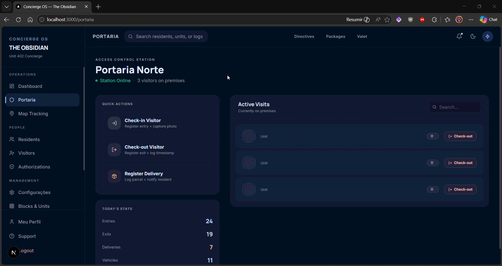

# 🏢 Sistema de Portaria com Rastreamento GPS

> ⚠️ **PROJETO EDUCACIONAL — ESTÁGIO** — Sistema incompleto, desenvolvido para fins de aprendizagem. Não utilizar em produção.

[](https://nestjs.com)
[](https://nextjs.org)
[](https://typescriptlang.org)
[](https://postgresql.org)
[](https://docker.com)

---

## 📋 Visão Geral

Sistema robusto de **gestão de portaria condominial** com módulos de controle de visitantes, rastreamento GPS de veículos e trilha de auditoria completa. Construído sobre uma arquitetura moderna baseada em containers, projetado para deploy confiável em VPS.

---

## 🎬 Demonstração do Sistema



---

## 🧱 Arquitetura do Sistema

```
┌──────────────────────────────────────────────────────────────┐
│                 Nginx (Reverse Proxy: HTTP/HTTPS)            │
│                  modo local (HTTP) ou produção (HTTPS)       │
└─────────────────────┬──────────────────────────────────────┘
                      │
         ┌───────────┴────────────┐
         │                        │
  ┌──────▼──────┐         ┌──────▼──────┐
  │  Next.js    │         │   NestJS    │
  │  Frontend   │         │   Backend   │
  │  porta 3000 │         │   porta 3001│
  └─────────────┘         └──────┬──────┘
                                │
                        ┌──────▼──────┐
                        │  PostgreSQL │
                        │   porta 5432│
                        └─────────────┘
```

---

## ⚙️ Stack Tecnológica

| Camada            | Tecnologia                                    |
|-------------------|-----------------------------------------------|
| **Frontend**      | Next.js 16 · React 19 · TypeScript · Tailwind |
| **Backend**       | NestJS 11 · TypeScript                         |
| **Banco**         | PostgreSQL 16                                 |
| **Infra**         | Docker Compose · Nginx · GHCR                 |
| **CI/CD**         | GitHub Actions · Deploy automatizado para VPS |
| **Monitoramento** | Grafana Cloud · Grafana Alloy                 |

---

## 📁 Estrutura do Projeto

```
appcondominio-docker/
├── apps/
│   ├── backend/              # API REST — NestJS
│   │   ├── src/
│   │   │   ├── app.controller.ts
│   │   │   ├── app.module.ts
│   │   │   └── main.ts
│   │   ├── Dockerfile
│   │   └── package.json
│   │
│   └── web/                 # Aplicação Web — Next.js
│       ├── src/
│       │   ├── app/          # Rotas (page.tsx, /login, /dashboard…)
│       │   ├── components/   # Componentes reutilizáveis
│       │   ├── hooks/        # Custom hooks (useAuth, useDashboard…)
│       │   ├── types/        # Definições TypeScript
│       │   └── data/         # Dados mock / fixtures
│       ├── Dockerfile
│       └── package.json
│
├── infra/
│   ├── alloy/                # Configuração do agente de monitoramento
│   │   └── config.alloy      # Configuração River do Grafana Alloy
│   ├── nginx/                # Configuração do reverse proxy
│   │   ├── nginx.conf
│   │   └── conf.d/
│   │       ├── app.conf            # Template HTTPS (produção)
│   │       ├── app.http.conf       # Configuração HTTP (local/teste)
│   │       └── default.empty.conf  # Neutraliza default.conf da imagem
│   └── postgres/             # Scripts de inicialização
│       ├── init.sql
│       └── postgres.conf
│
├── scripts/
│   ├── deploy.sh              # Script de deploy na VPS
│   ├── init-ssl.sh            # Setup SSL com Certbot
│   └── setup-vps.sh           # Provisionamento inicial
│
├── docs/                      # Documentação técnica e funcional
│   ├── Arquitetura-Tecnica-Recomendada.md
│   ├── Modelagem-Banco-de-Dados.md
│   ├── Api.md
│   └── releases/
│
├── docker-compose.yml              # Base dev/local
├── docker-compose.prod.http.yml    # Produção sem SSL (teste/local)
├── docker-compose.prod.https.yml   # Produção com SSL (recomendado)
├── docker-compose.prod.yml         # Arquivo legado
└── package.json               # Scripts de orquestração
```

---

## 🚀 Começando

### Pré-requisitos

- **Node.js** 20+
- **Docker** e **Docker Compose** v2
- **Git**

### Instalação

```bash
# Clonar o repositório
git clone https://github.com/cristovao-pereira/appcondominio-docker.git
cd appcondominio-docker

# Instalar dependências
npm install

# Copiar e configurar variáveis de ambiente
cp .env.example .env
# ↑ Edite o .env com suas senhas, chaves JWT e domínios
```

### Desenvolvimento — Apenas Frontend (rápido)

```bash
npm run dev
# → Acesse http://localhost:3000
```

### Desenvolvimento — Stack Completa com Docker _(recomendado)_

```bash
npm run dev:local
```

| Serviço    | URL                          |
|------------|------------------------------|
| Web        | http://localhost:3000        |
| Backend    | http://localhost:3001        |
| PostgreSQL | localhost:5432               |

Para remover os containers:

```bash
npm run dev:local:down
```

---

## 🐳 Deploy e Ambientes Docker

### Produção com SSL (recomendado)

```bash
npm run prod:https:up
```

Pré-requisitos:
- `DOMAIN` configurado com domínio real no `.env`
- certificados válidos em `/etc/letsencrypt/live/<seu-dominio>/`

### Produção sem SSL (teste/local)

```bash
npm run prod:http:up
```

### Atalhos

```bash
npm run prod:up      # equivalente ao modo HTTPS
npm run prod:down
```

> As imagens Docker são pulladas do **GitHub Container Registry (GHCR)** usando as variáveis `GITHUB_REPOSITORY` e `IMAGE_TAG`.
> O script `scripts/deploy.sh` já usa o modo HTTPS (`docker-compose.prod.https.yml`).

---

## 🔄 Pipeline CI/CD Automatizado

A automação de deploy foi configurada usando o GitHub Actions, conectando o repositório à VPS via SSH e transferindo as configurações e arquivos sensíveis.

```
Push na branch 'main' → GitHub Actions
    │
    ├── 1. Build & Push imagens (web + backend) → GitHub Container Registry (GHCR)
    ├── 2. Transferência de infraestrutura via SCP (docker-compose, configs, nginx)
    └── 3. Deploy via SSH:
           ├── docker login ghcr.io
           ├── docker compose pull
           └── docker compose up -d --remove-orphans
```

**Detalhes Técnicos do CI/CD (`.github/workflows/deploy.yml`):**
- **Trigger:** Automático em push na branch `main` e disparo manual (`workflow_dispatch`).
- **Compatibilidade:** Uso forçado do Node.js 24 (`FORCE_JAVASCRIPT_ACTIONS_TO_NODE24`) para evitar *warnings* de depreciação das actions (checkout, docker-login, etc).
- **Segurança:** As chaves de acesso (`VPS_HOST`, `VPS_USER`, `VPS_SSH_KEY`) ficam armazenadas nos **GitHub Secrets**.
- O arquivo `.env.prod` fica alocado apenas na VPS (e não no repositório), sendo carregado pelo Compose automaticamente na inicialização.

---

## ☁️ Infraestrutura: Oracle Cloud VPS

A aplicação está rodando ativamente em uma instância VPS da Oracle Cloud Infrastructure (OCI).

### Configurações de Deploy
- Sistema Operacional base: **Ubuntu 22.04+**
- IP Público: `164.152.247.168` (provisório)
- Usuário de deploy: `ubuntu` (adicionado ao grupo `docker` para evitar necessidade de root no CI).

### Setup de Firewall (Iptables & VCN)
Para garantir o acesso HTTP/HTTPS foram realizadas liberações de portas em dois níveis:
1. **Firewall Interno (Ubuntu):**
   ```bash
   sudo iptables -I INPUT 6 -m state --state NEW -p tcp --dport 80 -j ACCEPT
   sudo iptables -I INPUT 6 -m state --state NEW -p tcp --dport 443 -j ACCEPT
   sudo netfilter-persistent save
   ```
2. **Oracle VCN (Virtual Cloud Network):**
   Liberação de Ingress Rules (Ports 80/443) na *Default Security List* através do painel OCI.

---

## 📊 Observabilidade e Monitoramento (Grafana Cloud)

O sistema possui uma infraestrutura de observabilidade integrada com o **Grafana Cloud** utilizando o **Grafana Alloy** como agente coletor de telemetria leve. Esta abordagem consome pouquíssimo recurso (~15-20MB de RAM), sendo ideal para o limite da VPS Oracle Always Free.

### Componentes de Monitoramento

1. **Grafana Alloy**: Agente que roda em container no Docker Compose de produção. Ele lê a configuração River em [config.alloy](file:///home/cris/appcondominio-docker/infra/alloy/config.alloy), coleta as métricas locais e faz o *remote write* (envio remoto) seguro via HTTPS para a API do Grafana Cloud.
2. **Unix Exporter (Host Metrics)**: Coleta métricas de CPU, uso de RAM, uso de disco, tráfego de rede (coletor `netstat` ativo) e pressão de recursos de CPU/I/O (coletor `pressure` via PSI do kernel Linux).
3. **cAdvisor (Container Metrics)**: Coleta métricas de consumo individual de cada container Docker em tempo real. Configurado com `docker_only = true` para evitar dependências com o socket do containerd que não está exposto.

### Variáveis de Ambiente Necessárias (.env)

Para habilitar a observabilidade em produção, preencha as credenciais obtidas no painel do Grafana Cloud:

```bash
GRAFANA_CLOUD_PROMETHEUS_URL=https://prometheus-prod-xxx.grafana.net/api/prom/push
GRAFANA_CLOUD_PROMETHEUS_USER=seu_user_id
GRAFANA_CLOUD_API_KEY=glc_seu_token_de_acesso
```

### Configurações de Redirecionamento e Labels

Para facilitar a integração com dashboards padrões do Grafana (como o *Node Exporter Full* e *cAdvisor*), o Alloy reescreve as labels das métricas injetando:
- **`job`**: `integrations/node_exporter` (para métricas do host) e `integrations/cadvisor` (para métricas de containers).
- **`instance`**: O hostname real da máquina virtual (injetado dinamicamente usando `constants.hostname`).

### Comandos de Operação e Diagnóstico

*   **Verificar logs do coletor:**
    ```bash
    docker logs appcondominio-alloy
    ```
*   **Reiniciar o Alloy após mudança de configuração:**
    ```bash
    docker restart appcondominio-alloy
    ```
*   **Atualizar a configuração no servidor manualmente (SCP):**
    ```bash
    scp -i ~/oracle/oracle.key infra/alloy/config.alloy ubuntu@164.152.247.168:/opt/condominio/infra/alloy/config.alloy
    ssh -i ~/oracle/oracle.key ubuntu@164.152.247.168 "sudo docker restart appcondominio-alloy"
    ```

---

## 📖 Documentação

| Documento                                                      | Descrição                                |
|---------------------------------------------------------------|------------------------------------------|
| [Arquitetura Técnica Recomendada](docs/Arquitetura-Tecnica-Recomendada.md) | Visão técnica da arquitetura |
| [Modelagem do Banco de Dados](docs/Modelagem-Banco-de-Dados.md)     | Diagrama ER e schema SQL             |
| [Api.md](docs/Api.md)                                         | Endpoints da API REST                   |
| [Telas Principais do Sistema](docs/Telas-Principais-do-Sistema.md)  | Wireframes e fluxo de telas         |
| [Checklist de Release](docs/Checklist-Release-Deploy.md)            | Passos para deploy de release      |

---

## 🔧 Troubleshooting Rápido

| Problema                              | Solução                                                |
|---------------------------------------|--------------------------------------------------------|
| `npm run dev:local` não encontrado     | Execute `npm install` na raiz para atualizar scripts  |
| Conflito de portas                    | Ajuste os mapeamentos de porta em `docker-compose.yml` |
| Erro de pull no GHCR                  | Valide login do Docker no registry e permissões do token |
| Nginx reiniciando por certificado     | Use `npm run prod:http:up` para teste local sem SSL   |
| `404` em `/api/health` no localhost   | Verifique se o modo HTTP está ativo (`npm run prod:http:up`) |
| Métricas vazias no Grafana Cloud      | Valide as chaves do Grafana no `.env` e verifique os logs com `docker logs appcondominio-alloy` |
| Painel "CPU Frequency" sem dados      | Limitação física de VMs em nuvem (coletor cpufreq indisponível em instâncias virtualizadas) |

---

## 📝 Repositório Remoto

```
https://github.com/cristovao-pereira/appcondominio-docker
```
